<p align="center">
  
</p>

<p align="center">
  <a href="https://github.com/Flames4fun">
    
  </a>
  <a href="https://www.linkedin.com/in/luis-carlos-fuentes-de-avila-571153168/?trk=opento_sprofile_topcard">
    
  </a>
  <a href="mailto:luisayan100@gmail.com">
    
  </a>
</p>

<h2 align="center">Systems Engineer · Applied AI · Agentic Systems · Backend</h2>

<p align="center">
  I build software that connects <b>AI models</b>, <b>tools</b>, <b>APIs</b>, <b>databases</b> and <b>real workflows</b>.
</p>

---

## 🟥 About me

```txt
> whoami
Luis Carlos Fuentes De Avila

> profile
Systems Engineer focused on Applied AI, Agentic Systems, MCP tooling,
backend platforms, data automation and open-source collaboration.

> current_signal
LLM applications · RAG systems · AI agents · backend APIs · real data
```

I am a **Systems Engineer** focused on building practical software with **Applied AI**.

My current work is centered on:

- building **LLM-powered applications**;
- designing **RAG systems** that use real documents and real data;
- creating **AI agents** that use tools safely;
- working with **MCP tooling** and agent workflows;
- building backend systems with APIs, databases, tests and documentation;
- turning AI ideas into usable software products.

I also have a Machine Learning and Deep Learning foundation through **Andrew Ng / DeepLearning.AI**, including model evaluation, neural networks, regularization, hyperparameter tuning and optimization.

---

## ⚡ My three professional signals

<table>
  <tr>
    <td width="33%">
      <h3>Applied AI Engineer</h3>
      <p>LLM apps, RAG systems, AI agents and automation workflows using real data.</p>
    </td>
    <td width="33%">
      <h3>Software Engineer</h3>
      <p>Backend, APIs, databases, tests, Docker, TypeScript, Python and maintainable systems.</p>
    </td>
    <td width="33%">
      <h3>Agentic Systems Engineer</h3>
      <p>MCP tooling, tool-using agents, guardrails, workflow automation and AI safety patterns.</p>
    </td>
  </tr>
</table>

---

## 🛠️ Tech stack

<p align="center">
  
  
  
  
  
  
  
  
  
  
</p>

---

## 🧠 AI / Agentic focus

<p align="center">
  
  
  
  
  
  
</p>

---

## 🚀 Work I want recruiters to notice

<table>
  <tr>
    <td width="50%">
      <h3>🛡️ CSL Core Contributions</h3>
      <p>
        Open-source work around AI governance, MCP tool trust, LlamaIndex guards and deterministic policy enforcement for AI agents.
      </p>
      <p>
        <b>Why it matters:</b> shows agent safety, MCP thinking, guardrails, policy design and real open-source contribution.
      </p>
      <a href="https://github.com/Chimera-Protocol/csl-core/pulls?q=is%3Apr+author%3AFlames4fun">
        
      </a>
    </td>
    <td width="50%">
      <h3>🧬 LandmarkDiff Contributions</h3>
      <p>
        Contributions to computer-vision / ML tooling: ONNX runtime paths, TPS pipeline work, MediaPipe landmark wrappers and regression tests.
      </p>
      <p>
        <b>Why it matters:</b> shows Python, ML pipelines, testing discipline and ability to work inside complex codebases.
      </p>
      <a href="https://github.com/dreamlessx/LandmarkDiff-public/pulls?q=is%3Apr+author%3AFlames4fun">
        
      </a>
    </td>
  </tr>
  <tr>
    <td width="50%">
      <h3>⚙️ Nadzoring Contribution</h3>
      <p>
        Async DNS benchmark API with safe sync/async behavior, fallback consistency and tests for a Python networking tool.
      </p>
      <p>
        <b>Why it matters:</b> shows Python library work, async programming, API stability and production-minded behavior.
      </p>
      <a href="https://github.com/alexeev-prog/nadzoring/pull/53">
        
      </a>
    </td>
    <td width="50%">
      <h3>🐍 Hiero SDK Python Contribution</h3>
      <p>
        Small but clean contribution to a real Python SDK: return type hint improvement for better type checking and IDE support.
      </p>
      <p>
        <b>Why it matters:</b> shows comfort with SDK contribution flow, scoped PRs, code quality and open-source standards.
      </p>
      <a href="https://github.com/hiero-ledger/hiero-sdk-python/pull/1655">
        
      </a>
    </td>
  </tr>
  <tr>
    <td width="50%">
      <h3>🧩 DataOps E-commerce Platform</h3>
      <p>
        End-to-end data engineering project: ingestion, DuckDB warehouse, dbt models, data tests, reconciliation and API serving.
      </p>
      <p>
        <b>Why it matters:</b> shows data engineering, SQL modeling, quality gates and reproducible analytics pipelines.
      </p>
      <a href="https://github.com/Flames4fun/dataops-ecommerce-platform">
        
      </a>
    </td>
    <td width="50%">
      <h3>🟥 Exploria Platform</h3>
      <p>
        Private product-style platform with API, MCP server, shared contracts and conversational architecture.
      </p>
      <p>
        <b>Why it matters:</b> even if private, it represents backend architecture, MCP direction, product thinking and applied AI systems design.
      </p>
      <a href="https://github.com/Flames4fun/exploria-platform">
        
      </a>
    </td>
  </tr>
</table>

---

## 🔥 Open-source contribution signal

I use open source to practice real engineering: reading existing code, understanding maintainers' expectations, writing scoped PRs, adding tests and documenting behavior.

### Strongest contribution areas

- **AI governance and agent safety**
  - MCP tool trust policy.
  - LlamaIndex tool guard integration.
  - Safety policies for AI agent execution.

- **Python libraries and tooling**
  - Async APIs.
  - Type hints.
  - CLI behavior.
  - Runtime stability.
  - Tests and backward compatibility.

- **ML / computer vision infrastructure**
  - TPS / RBF pipeline work.
  - ONNX runtime integration.
  - MediaPipe landmark wrappers.
  - Regression and parity tests.

<p align="center">
  <a href="https://github.com/Chimera-Protocol/csl-core/pulls?q=is%3Apr+author%3AFlames4fun">
    
  </a>
  <a href="https://github.com/dreamlessx/LandmarkDiff-public/pulls?q=is%3Apr+author%3AFlames4fun">
    
  </a>
  <a href="https://github.com/alexeev-prog/nadzoring/pull/53">
    
  </a>
  <a href="https://github.com/hiero-ledger/hiero-sdk-python/pull/1655">
    
  </a>
</p>

---

## 📈 GitHub signal


<p align="center">
  
</p>
<p align="center">
 
</p>
<p align="center">
   
  
</p>

---

## 🧭 Current roadmap

```txt
2026 focus:
[01] Build production-style LLM applications
[02] Build RAG systems with evaluation and citations
[03] Build MCP tools and agent workflows
[04] Strengthen backend architecture with TypeScript and Python
[05] Keep contributing to open source with scoped, tested PRs
```

---

## 🧬 Engineering principles

```txt
Readable code > clever code
Small PRs > giant rewrites
Real tests > optimistic assumptions
Clear contracts > hidden behavior
Useful AI > flashy demos
```

---

<p align="center">
  <b>Building software where AI is not decoration — it is part of the system.</b>
</p>
